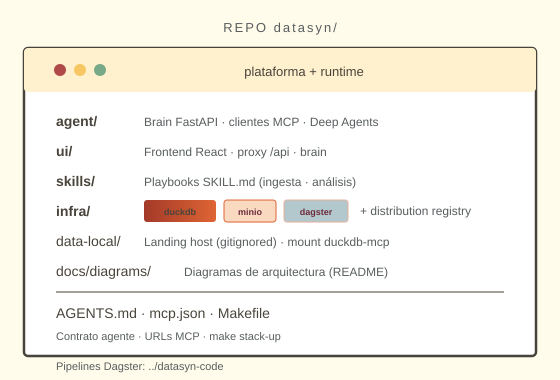
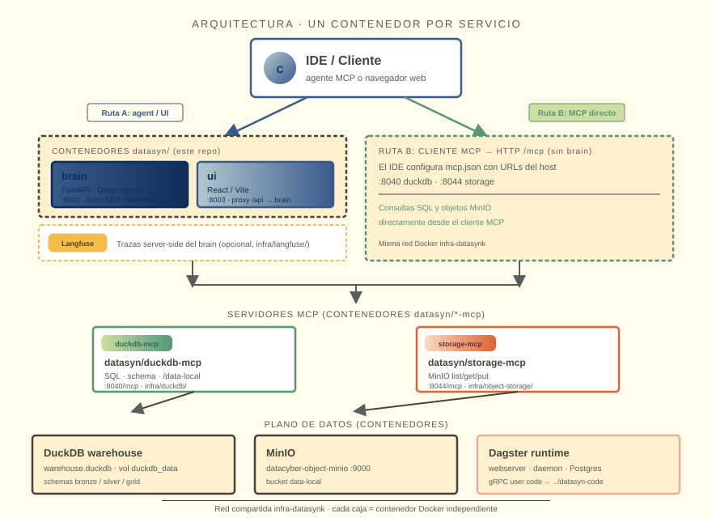
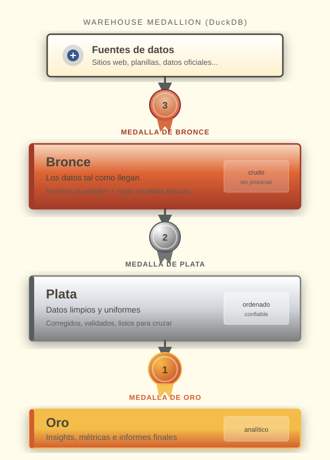
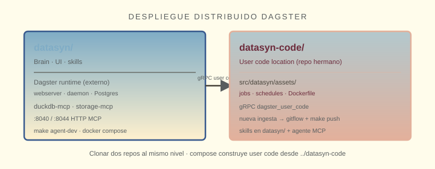
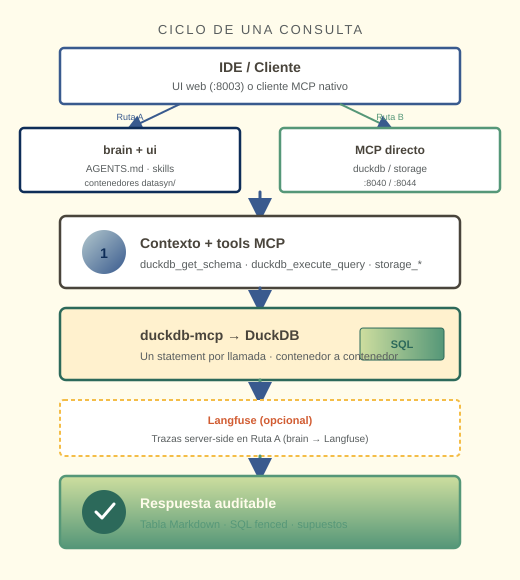
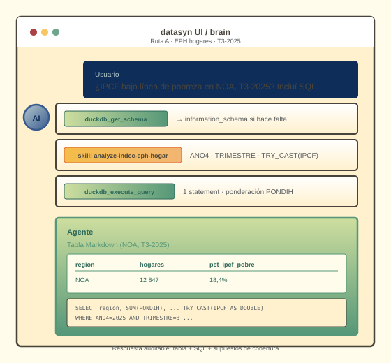

# 🧠 datasyn

> [Español (canonical)](README.md)

> **⚠️ Active development**
>
> **AI-driven** platform for **public-data analytics** on your own infra: DuckDB warehouse, MinIO, Dagster runtime, operational agent via **MCP**.
>
---

## Index

- [About](#about)
- [Architecture](#architecture)
- [Medallion](#medallion)
- [Distributed layout](#distributed-layout)
- [New ingest (gitflow)](#new-ingest)
- [MCP servers](#mcp-servers)
- [Query cycle](#query-cycle)
- [AI development](#ai-development)
- [Local run](#local-run)
- [Datasets](#datasets)
- [Makefile](#makefile)
- [References](#references)

---

<a id="about"></a>

## About

**datasyn** is the **platform layer**: brain (FastAPI + Deep Agents), React UI, HTTP MCP servers, Docker stacks under `infra/`.

Dagster **pipelines** live in sibling [`datasyn-code`](../datasyn-code). **Dagster runtime** (webserver, daemon, gRPC user code) deploys from `infra/dagster/` in this repo.

The agent **runs** SQL, lists MinIO objects, and triggers Dagster materializations — with audit trail (SQL, tool calls, versioned skills). Operational MCP servers today: **`duckdb-mcp`** and **`storage-mcp`**.

| Term | Meaning |
|------|---------|
| **Brain** | FastAPI graph + MCP clients |
| **MCP** | HTTP tool contract (`duckdb_*`, `storage_*`) |
| **Skill** | `SKILL.md` playbook (ingest, analysis, catalog) |
| **Code location** | gRPC image with `datasyn` package |

<p align="center"></p>

---

<a id="architecture"></a>

## Architecture

<p align="center"></p>

Each service runs in its **own Docker container** on **`infra-datasynk`**:

| Route | Flow |
|-------|------|
| **A — agent / UI** | `ui` (:8003) → `brain` (:8002) → MCP servers → data plane |
| **B — direct MCP** | IDE `mcp.json` → `duckdb-mcp` / `storage-mcp` (no brain) |

**Observability (optional):** **Langfuse** (`infra/langfuse/`) collects server-side traces from **brain** (LLM spans, MCP tool calls). See [`INSTALL.md`](INSTALL.md).

| Container | Image | Port |
|-----------|-------|------|
| brain | `datasyn/brain` | `:8002` |
| ui | `datasyn/ui` | `:8003` |
| duckdb-mcp | `datasyn/duckdb-mcp` | `:8040` |
| storage-mcp | `datasyn/storage-mcp` | `:8044` |
| dagster_* | `datasyn/dagster-*` | UI `:3001` |

Agent rules: [`AGENTS.md`](AGENTS.md).

---

<a id="medallion"></a>

## Medallion

<p align="center"></p>

`bronze` → `silver` → `gold` in DuckDB. Pipeline implementation: [`datasyn-code`](../datasyn-code).

---

<a id="distributed-layout"></a>

## Distributed layout

Two repos: platform in **datasyn**, user code in **datasyn-code**.

<p align="center"></p>

```bash
git clone …/datasyn.git && git clone …/datasyn-code.git
cd datasyn
make -C infra/object-storage bootstrap
make -C infra/object-storage up && make -C infra/duckdb up && make -C infra/dagster up
```

| Repo | Contents | Key commands |
|------|----------|--------------|
| datasyn | Brain, UI, skills, infra (duckdb, minio, Dagster runtime) | `make agent-dev` · stacks in `infra/` · [`INSTALL.md`](INSTALL.md) |
| datasyn-code | Bronze assets, jobs, schedules, gRPC Dockerfile | `make dev` · `make push` |

---

<a id="new-ingest"></a>

## New ingest (gitflow)

Recommended flow to add a data source:

1. **Clone** [`datasyn`](.) and [`datasyn-code`](../datasyn-code) side by side; start stacks (`infra/README.md`).
2. **Configure** the agent: [`mcp.json`](mcp.json), skills under [`skills/`](skills/) (e.g. [`ingest-scrape-news-bronze`](skills/ingest-scrape-news-bronze/SKILL.md)), [`AGENTS.md`](AGENTS.md).
3. **Develop via gitflow** in **`datasyn-code`**: `feature/<source>` branch, assets under `src/datasyn/assets/bronze/<source>/`, job + schedule; PR → merge to `main`.
4. **Publish** code location: `make -C ../datasyn-code push` and redeploy `dagster_user_code` (see [`INSTALL.md`](INSTALL.md)).
5. **Validate** in Dagster UI (`:3001`).

Pipeline code is **reviewed in git** in `datasyn-code`; the agent uses **`duckdb_*`** and **`storage_*`** for SQL, landing, and checks on `/data-local`.

---

<a id="mcp-servers"></a>

## MCP servers (datasyn)

Two HTTP containers — `datasyn/duckdb-mcp` and `datasyn/storage-mcp`. See [`mcp.json`](mcp.json). Route B: IDE connects directly. Route A: brain proxies the same endpoints.

| Prefix | Main tools |
|--------|------------|
| `duckdb_*` | `get_schema`, `execute_query`, `list_data_mount` |
| `storage_*` | `list_buckets`, `list_objects`, `get_object_text`, `put_object_*` |

---

<a id="query-cycle"></a>

## Query cycle

<p align="center"></p>

Example (Route A, EPH households):

<p align="center"></p>

One SQL statement per `duckdb_execute_query`. Schema first — no invented columns.

---

<a id="ai-development"></a>

## AI development

Skills: [`skills/`](skills/). Pipeline ingest skills also in [`datasyn-code`](../datasyn-code). Operational contract: [`AGENTS.md`](AGENTS.md).

---

<a id="local-run"></a>

## Local run

Full guide: [`INSTALL.md`](INSTALL.md).

**Daily dev — brain (`uv`) + UI (`npm`) on the host; infra in Docker:**

```bash
cp .env.example .env
make uv-sync && make ui-install
make -C infra/object-storage up
make -C infra/duckdb up
make -C infra/dagster up
make agent-dev
```

**Prod-like stack (brain/ui in containers — not daily dev):**

```bash
make -C infra/object-storage bootstrap
make -C infra/object-storage up && make -C infra/duckdb up && make -C infra/dagster up && make -C infra/agent up
```

Publish user code after pipeline changes:

```bash
make -C ../datasyn-code push
# redeploy: see INSTALL.md (compose recreate dagster_user_code)
```

---

<a id="datasets"></a>

## Datasets

INDEC EPH, Censo/UCA, elections 2023, Boletín Oficial, press (Infobae, Clarín, La Nación, TN), OECD AI incidents — see [`datasyn-code`](../datasyn-code/src/datasyn/assets/).

---

<a id="makefile"></a>

## Makefile

`make help` (root) · [`infra/README.md`](infra/README.md) · `make agent-dev` · `make uv-sync`

Sibling repo: `make -C ../datasyn-code help`.

---

<a id="references"></a>

## References

- [`INSTALL.md`](INSTALL.md) · [`AGENTS.md`](AGENTS.md) · [`skills/`](skills/) · [`docs/diagrams/`](docs/diagrams/)
- [`../datasyn-code`](../datasyn-code)
- [MCP](https://modelcontextprotocol.io/) · [DuckDB](https://duckdb.org/)

---

> Documentation drift is a bug — open an issue if README and compose/MCP tools disagree.
