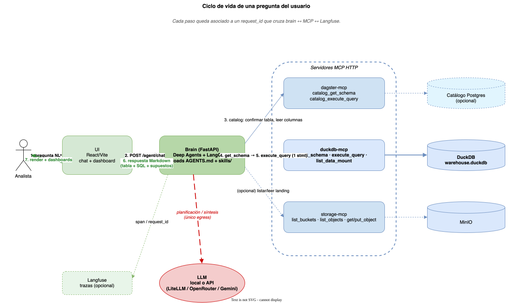

# DataSyn

   

**Open-source AI system for analyzing public data. 100% on your own infrastructure.**

> Spanish version (canonical): [`README.md`](README.md)

DataSyn ingests, models and queries open datasets through a conversational agent. Every model answer is backed by SQL and auditable tool calls. No file leaves your host.

[How to run it →](INSTALL.md) · [Agent rules →](AGENTS.md) · [Skills →](skills/) · [Dagster pipelines →](infra/dagster/mcp/dagster-code/projects/datasyn/src/datasyn/assets/) · [Diagrams →](docs/diagrams/)

---

## Why it exists

> Public policy doesn't need ungrouped information — it needs **understandable, reviewable** information.

DataSyn separates three problems usually mixed together in any "AI + data" stack:

| Problem | Bounded solution |
|---|---|
| Raw datasets (`;`-delimited TXTs, ZIP bundles, paginated PDFs, brittle scrapes) | Versioned Dagster pipelines (`bronze` → `silver` → `gold`) |
| Your file gets uploaded to an opaque third party | 100% local stack: DuckDB + MinIO + brain on your host |
| Operational know-how scattered across personal notebooks | Versioned `SKILL.md` playbooks the agent loads at startup |

---

## What's inside

| Layer | Components |
|---|---|
| **Data** | MinIO (S3) · DuckDB (`bronze`/`silver`/`gold`) · Iceberg REST (optional) |
| **Orchestration** | Dagster (webserver, daemon, Postgres) + `datasyn` code location |
| **AI interface** | `duckdb-mcp` · `storage-mcp` · `dagster-mcp` (HTTP MCP) |
| **Agent** | FastAPI + Deep Agents + LangChain · `SKILL.md` skills |
| **UI** | React/Vite · Markdown · Plotly · Vega-Lite · Mermaid render |
| **Models** | LiteLLM (local/remote) · OpenRouter · Gemini |
| **Observability** | Langfuse (optional, self-hosted) |

### Architecture


> Editable: [`docs/diagrams/architecture.drawio`](docs/diagrams/architecture.drawio)

---

## Bundled pipelines

Under `infra/dagster/.../assets/bronze/`:

| Dataset | Source | Granularity |
|---|---|---|
| INDEC EPH (microdata) | `usu_hogar_*.txt`, `usu_individual_*.txt` | Quarterly, append per quarter |
| INDEC Censo 2022 | Census tracts + UCA indicators | Per tract / department / province |
| Argentina 2023 General Election | argentina.gob.ar (official ZIP) | Per polling table / circuit |
| Boletín Oficial — Section 3 | boletinoficial.gob.ar | Daily partition (PDF + HTML + manifest) |
| Press | Infobae · Clarín · La Nación | Daily partition per section |

These are real flows the agent uses to feed its analyses, not toy examples. Add yours via a Dagster bronze asset and a SKILL.md.

---

## How it's used



```text
User:    What share of households in NOA had IPCF below the poverty line
         in Q3-2025? Show me the SQL.

Agent →  dagster_catalog_execute_query  (descriptions for IPCF/REGION/PONDIH)
      →  duckdb_get_schema              (types: IPCF VARCHAR → TRY_CAST)
      →  duckdb_execute_query           (one SELECT, weighted by PONDIH)

UI    ←  Markdown: table + SQL block + assumptions + coverage notes
Traces ←  request_id stitched across brain ↔ MCP ↔ Langfuse
```

The agent **does not** open DB connections or browse the filesystem freely. Its full surface is the list in `mcp.json` plus Deep Agents helpers (`read_file`, `write_file`, `task`, ...). Hard rules in [`AGENTS.md`](AGENTS.md).

---

## Sovereignty

| Piece | Where it runs |
|---|---|
| Raw data (CSV/TXT/PDF/ZIP) | `data-local/` and MinIO on your host |
| `warehouse.duckdb` | Docker volume `duckdb_data` on your host |
| Pipelines, brain, UI | Containers on your `infra-datasynk` network |
| LLM | Your call: local (Ollama/vLLM via LiteLLM), OpenRouter, or Gemini |
| Traces | Self-hosted Langfuse (optional) |

Only possible egress: the model call. Pointed at an on-prem model via LiteLLM, the system is fully offline. What travels to the model is summaries / SQL / column names — not files.

---

## Skills extend the system, written by analysts (not developers)

A **skill** is a versioned `SKILL.md` playbook. The agent picks it up at startup and follows it whenever it recognizes the domain. **One well-written skill teaches the system to ingest a new dataset, build new tables, run a recurring analysis, or produce a report — without touching brain or UI code.**

Who writes them: data analysts, data journalists, academic researchers, government / civil-society teams. All you need is Markdown plus knowing the right `WHERE` / `GROUP BY` / weighting for your dataset.

See full sample anatomy and the four supported cases (ingest / derived table / recurring analysis / periodic report) in the Spanish [`README.md`](README.md#skills-el-sistema-lo-extienden-los-analistas-no-los-developers).

---

## Quick start

Full instructions: [`INSTALL.md`](INSTALL.md). Short version:

```bash
make bootstrap        # network infra-datasynk + volumes duckdb_data, storage
make images-prepare   # local registry + build all images
make infra-up         # MinIO, DuckDB+MCP, Dagster+MCP
make agent-up         # brain + UI
```

Or `make stack-up` to chain the last two. Local dev with hot reload: `make mcp-up && make agent-dev`. All targets: `make help`.

UI: `http://localhost:8003` · Dagster: `http://localhost:3001` · MinIO console: `http://localhost:9001`.

---

## Status

| Component | Status |
|---|---|
| Brain (FastAPI) + UI | Live |
| `duckdb-mcp`, `storage-mcp`, `dagster-mcp` | Live |
| Bronze pipelines (INDEC, BOA, elections, press) | Live |
| `silver` / `gold` layers | Minimal (only `gold.indec_eph_*` so far) |
| Metadata catalog | Optional, contract defined |
| Iceberg REST | Implemented, opt-in |
| Open-source license | TBD (MIT / Apache-2.0 suggested) |

---

## Contributing

In order of increasing technical effort:

- Write a `SKILL.md` for a dataset already in the warehouse — pure Markdown.
- Add a Dagster bronze asset + skill for a new public dataset (province, city, agency).
- Report discrepancies between agent answers and manual analysis — most valuable bugs.
- Reusable components (`utils/`, `components/`) when a transformation repeats across assets.

Small PRs, one piece per PR. Issues welcome.

---

## References

- [`AGENTS.md`](AGENTS.md) — agent contract and operational rules
- [`INSTALL.md`](INSTALL.md) — full deployment guide
- [`docs/diagrams/`](docs/diagrams/) — editable `.drawio` (architecture, data flow, question lifecycle)
- [`Makefile`](Makefile) — `make help`
- [`skills/`](skills/) — runnable playbooks
- [`mcp.json`](mcp.json) — MCP URLs

---

> If anything in this README doesn't match the code, open an issue. Documentation drift is as important as code bugs.
