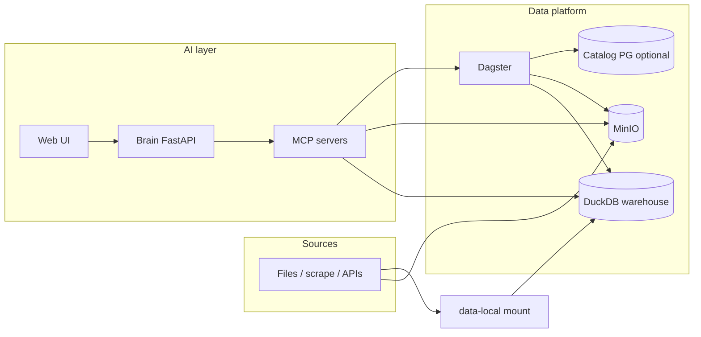

# Datacyber (DataSyn)

Monorepo for an **AI-assisted data processing and analytics stack**: natural-language agents operate over a **DuckDB** warehouse, **Dagster** orchestration and metadata catalog, and **MinIO** object storage, exposed to the agent through **HTTP MCP** tool servers. A **FastAPI “brain”** plus **Vite UI** (and optional **JupyterLab**, **Telegram**) complete the loop for human-in-the-loop analysis on open and public data.

For a product-oriented vision in Spanish, see [`CONCEPTO.md`](CONCEPTO.md).

---

## Goals

- **Discover, load, and reason about** public datasets with reproducible pipelines and inspectable steps—not black-box automation.
- **Separate concerns**: durable data and jobs live in infra (warehouse, orchestrator, object store); the AI layer issues **bounded, auditable** tool calls (SQL, listings, catalog queries, storage ops).
- **Same stack for humans and agents**: operators use Dagster and notebooks; agents use MCP tools aligned with those systems.

---

## Architecture

The system splits into a **data platform layer** (what you store and how you run pipelines) and an **AI layer** (how questions become operations). Both share Docker network **`infra-datasynk`** and named volumes (e.g. **`duckdb_data`**, **`storage`**).

### Data platform layer

| Component | Role |
|-----------|------|
| **Object storage (MinIO)** | S3-compatible **landing zone** and lake-style storage: CSV/TXT/ZIP, derived artifacts, and optional **Apache Iceberg** table files when publishing is configured in Dagster/DuckDB. |
| **DuckDB** | **Analytical engine** and default warehouse file (`warehouse.duckdb`): SQL, `read_csv_auto` ingest from the **`data-local`** bind mount, medallion-style schemas (**`bronze`**, **`silver`**, **`gold`**). MCP exposes schema listing and **one statement per call** execution. |
| **Dagster** | **Orchestration**: assets, jobs, schedules; Postgres for run storage; **code locations** under `infra/dagster/mcp/dagster-code/projects/`. MCP can scaffold projects and run **catalog SQL** when `DATABASE_URL` / `CATALOG_DATABASE_URL` is set. |
| **Iceberg (optional)** | Some Dagster assets can materialize to **Iceberg** on object storage when REST catalog / env is configured (`datasyn.utils.iceberg`); otherwise tables stay **DuckDB-native**. |

**Typical data flow**

1. Raw files land in **MinIO** and/or the repo’s **`data-local/`** tree (mounted read-only into DuckDB MCP for SQL paths under `/data-local/...`).
2. **Dagster** runs ingestion and transformation assets; results are tables in DuckDB and/or Iceberg-backed relations.
3. **Catalog** (Postgres, optional) registers datasets for discovery; agents query it before blind file globbing when metadata is enough.
4. **Agents** read schema, run aggregates, or trigger documented ingest patterns—always with traceable SQL and paths.



### AI layer

| Piece | Role |
|-------|------|
| **Brain** (`agent/`) | LLM-driven orchestration: plans tool use, streams responses, enforces constraints from **`AGENTS.md`** (warehouse rules, MCP names, ingest patterns). |
| **MCP servers** | Thin HTTP bridges: **`duckdb`** (schema, SQL, directory listing under `/data-local`), **`storage`** (list/get/put objects on MinIO), **`dagster`** (projects, deploy helpers, catalog SQL). URLs are defined in root **`mcp.json`** (Docker DNS names on the shared network, or host ports for local dev). |
| **Skills** (`skills/`) | Versioned **`SKILL.md`** playbooks (e.g. INDEC EPH ingest, catalog SQL, analysis templates). The agent loads these for repeatable procedures instead of ad-hoc guesses. |
| **Human in the loop** | Users steer via the **UI**, optional **Telegram** bot, or API; the stack favors explicit SQL and logged tool calls for review. |

Optional **`infra/litellm/`** and **`infra/langfuse/`** stacks (see `Makefile` comments) can sit in front of model providers for routing and observability; wire them via root **`docker-compose.yaml`** / `.env` as needed.

---

## Repository layout

| Path | Role |
|------|------|
| `agent/` | Brain service (FastAPI), MCP clients, graph/orchestration |
| `ui/` | Vite frontend; proxies API to the brain |
| `skills/` | Deep Agents skill playbooks (`SKILL.md`) |
| `data-local/` | Local data mirror for DuckDB paths (**gitignored**; bind-mounted into DuckDB MCP) |
| `mcp.json` | HTTP MCP server URLs for the brain |
| `compose.env` | Comment template for Docker/brain env (merge with root `.env`) |
| `docker-compose.yaml` | Root stack: brain, UI, Jupyter; optional Telegram profile |
| `AGENTS.md` | **Authoritative** agent + warehouse + MCP constraints (also mounted into the brain container) |
| `Makefile` | Bootstrap, infra, MCP slice, agent, full stack targets (`make help`) |

### Infra stacks (`infra/`)

Each stack has its own **`docker-compose.yaml`** and service-specific subfolders:

| Stack | Compose file | Notes |
|-------|----------------|--------|
| **Object storage** | `infra/object-storage/docker-compose.yaml` | MinIO + **storage-mcp** |
| **Distribution (registry)** | `infra/distribution/docker-compose.yaml` | [OCI Distribution](https://hub.docker.com/_/registry) image registry (**`registry:3`**), service **`distribution`** on port **5000** (override with **`REGISTRY_PUBLISH_PORT`**) |
| **DuckDB** | `infra/duckdb/docker-compose.yaml` | Warehouse + **duckdb-mcp**; **profile `ui`** = DuckDB Local UI (holds DB lock while running) |
| **Dagster** | `infra/dagster/docker-compose.yaml` | Webserver, daemon, Postgres, **dagster-mcp**, bind-mounted **`mcp/dagster-code/projects/`** |
| **Telegram** | `infra/telegram_bot/docker-compose.yaml` | Optional bot integration |

Active code location: **`infra/dagster/mcp/dagster-code/projects/datasyn/`** (includes **`Dockerfile`** → `dagster_user_code_image`).

Other optional folders: **`infra/langfuse/`**, **`infra/litellm/`**, **`bot_integrations/telegram/`**.

---

## Prerequisites

- **Docker** and **Docker Compose** v2
- **Make** (optional but recommended)
- For **local dev without Docker brain**: **Python 3.11+** and **Node.js** for `agent-dev` (see Makefile)

---

## Quick start

1. **Shared Docker network and volumes** (once per machine):

   ```bash
   make bootstrap-infra-primitives
   ```

   Creates network **`infra-datasynk`** and volumes **`duckdb_data`**, **`storage`**.

2. **Infra** — object storage, DuckDB + MCP, Dagster (+ MCP), optional Telegram per `Makefile`:

   ```bash
   make infra-up
   ```

   Build images first: `make infra-build`.

3. **Agent + UI** (after infra is healthy):

   ```bash
   make agent-up
   ```

   Full stack: `make stack-up` (infra then agent).

4. **Local development** (brain on host with hot reload, UI on Vite):

   ```bash
   make mcp-up    # if infra is not already up
   make agent-dev
   ```

   With the brain on the host, **`mcp.json`** service hostnames (`duckdb-mcp`, `dagster-mcp`, `storage-mcp`) are rewritten to **`127.0.0.1`** on ports **8040**, **8043**, **8044**. See `compose.env` for commentary.

### Compose-only equivalent

```bash
docker network create infra-datasynk 2>/dev/null || true
docker volume create duckdb_data 2>/dev/null || true
docker volume create storage 2>/dev/null || true

docker compose -f infra/object-storage/docker-compose.yaml up -d
docker compose -f infra/distribution/docker-compose.yaml up -d
docker compose -f infra/duckdb/docker-compose.yaml up -d
docker compose -f infra/dagster/docker-compose.yaml up -d
docker compose up -d
```

Start **object storage** before consumers; align **`mcp.json`** URLs with where MCP services listen (Docker service names on the shared network vs. `localhost` for hybrid dev).

### MCP-only slice

```bash
make mcp-up
```

Useful when you want tool endpoints for `make agent-dev` without the full root compose.

### DuckDB Local UI (optional)

The warehouse file allows **one writer at a time**. The Local UI holds a long-lived lock. It is behind compose **profile `ui`**:

```bash
make infra-duckdb-ui-up
```

Stop it before heavy MCP ingest if you see lock errors: `make infra-duckdb-ui-down`.

---

## Configuration

| Area | What to configure |
|------|---------------------|
| **Per-stack env** | Copy `*.env.example` → `.env` under `infra/object-storage/`, `infra/dagster/`, `infra/duckdb/`, etc. |
| **DuckDB MCP** | Optional `infra/duckdb/mcp/.env` (see `infra/duckdb/mcp/.env.example`) |
| **Dagster user code** | `make infra-up` builds `dagster_user_code_image:latest` from `infra/dagster/mcp/dagster-code/projects/datasyn` |
| **Brain** | Root `.env` + `compose.env`; **`mcp.json`** at repo root sets MCP base URLs |
| **Catalog** | Set `DATABASE_URL` or `CATALOG_DATABASE_URL` on **dagster-mcp** for `dagster_catalog_*` tools; see `skills/catalog-sql/` |

---

## Security and `.gitignore`

**Do not commit:**

- `.env` / `.env.*` (except allowed `*.env.example` patterns)
- Private keys: `*.pem`, `*.p12`, `*.pfx`, SSH key material
- Local data and DB files: `data-local/`, `*.duckdb`, etc.

Nested stacks may add rules; **`infra/dagster/mcp/dagster-code/projects/.gitignore`** covers generated paths under projects.

If a private key was ever committed, **rotate** it and scrub history (`git filter-repo`, BFG) on shared remotes.

---

## Operations and troubleshooting

| Symptom | Likely cause | Mitigation |
|---------|----------------|------------|
| DuckDB **lock** / IO errors from MCP | Another process has the DB file open (often **DuckDB UI** profile) | `make infra-duckdb-ui-down` or avoid `--profile ui` during ingest |
| **InvalidAccessKeyId** from storage MCP | Wrong MinIO host or credentials | Use the application MinIO endpoint from **`infra/object-storage`** docs; match **`MINIO_ROOT_*`** in `.env` |
| Agent cannot reach MCP | `mcp.json` URLs / firewall | On host dev, use `make mcp-up` and ports 8040/8043/8044; in Docker, use service names on **`infra-datasynk`** |
| Dagster code not updating | Stale user-code image | Rebuild per `Makefile` / `dagster_user_code_image` and recreate containers |

Use **`make help`** for all targets; warehouse and tool naming details live in **`AGENTS.md`**.

---

## Further reading

- **[`AGENTS.md`](AGENTS.md)** — MCP tool names, DuckDB ingest rules, catalog-first workflow, forbidden patterns
- **[`Makefile`](Makefile)** — `make help` for orchestration commands
- **[`skills/`](skills/)** — Ingest and analysis playbooks
